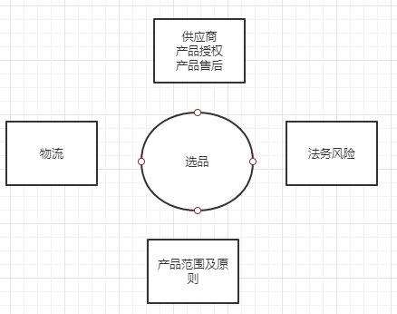

## 产品相关

### 产品需要考虑维度分析

+ 选品原则及依据、闭环
+ 上下架原则及依据、闭环
+ 做营销活动、区域推广原则及依据、闭环
+ 供应商分类及选择原则及依据、产品质量闭环 （主要考虑点是售后问题及授权相关法务合规问题）
+ 产品法务相关风险规避流程（供应商提供产品授权）
+ 销量情况，如：近一个月销量状态分析
+ 物流层面考虑原则及依据、闭环

选品各个维度相关性（一行一行看）

|          | 选品 | 上下架 | 营销活动 | 供应商 | 法务风险 | 销量 | 物流问题 |
| -------- | ---- | ------ | -------- | ------ | -------- | ---- | -------- |
| 选品     |      | 1      | 1        | 1      | 1        |      | 1        |
| 上下架   | 1    |        |          |        |          | 1    |          |
| 营销活动 | 1    |        |          | 1      |          | 1    | 1        |
| 供应商   |      |        |          |        | 1        |      |          |
| 法务风险 |      | 1      |          |        |          |      |          |
| 销量     |      | 1      | 1        |        |          |      | 1        |
| 物流问题 |      |        |          |        |          | 1    |          |

### 选品原则及依据、闭环（开发新产品原则）

+ 同行选品参考
+ 行业相关新产品开发
+ 地域性产品分析及开发
+ 相关性产品开发，如：配件+螺丝刀
+ 拥有自己的产品：条件允许的情况下，后面做一些自己工厂的产品

闭环：产品选品评估范围（如从开发产品、评估产品可行性、供应商可行性、法务风险可行性、物流可行性等方面进行评估，评估过程需要保留好供应商详情及售后详情等相关信息）

