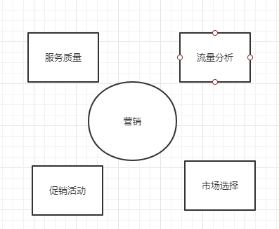

## 营销相关

### 营销目标

+ 参考同行
+ 追平同行
+ 超越同行

### 营销策略

+ 促销活动，做一个促销活动区域，清理库存，减少损失，提升用户活跃度
+ 引流（国外直播引流、多marketing 网站、自主建立在线帮助的论坛主页导流、相关性社交平台推广）
+ 服务体验提升（客服、售前、售后、回访、节假日等）  --品牌形象
+ 网站体验提升（本地化部点，提升当地服务体验，移动端支持等） --品牌形象

