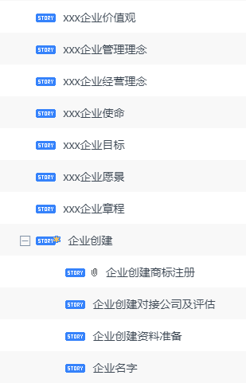

# 公司层面

- 愿景、目标
- 产品定位及产品边界
- 公司制度及管理方式雏形
- 各项工作处理流程，迭代优化计划
- 销售目标（销售额多少）
- 激励制度

# 技术
- 网站流量分析；
用户人群分析，总结出人员来自哪里，是不是全球范围内，有访问不到的情况；触达率，停留时间； 网站流量指标分析
收藏数量;
- 网站按地域进行分布式部署，避免因访问不到，损失地域用户
- 移动端适配，避免损失掉移动端用户
- 网站访问效率及加速

# 营销层面
- 网站促销区：库存产品
- 网站内容分区及点击量统计，方便分析用户更喜欢那些区域。
- 论坛建立，方便用户交流及产品技术积累
- 活跃论坛，可以使用论坛积分， 做一些促销活动

# 产品及行业层面
这个你更懂，我只说下自己见解
+ 当前网站选品方式：按流行最新产品选品迭代方式进行的；可能达不到扩充效果，不能扩充，风险就比较大，比如某款产品GG了，网站上架的配件会跟着GG。
+ 扩充产品及下架原则：
  + 按流行最新产品进行扩充
  + 按经典产品进行扩充
  + 按市场营收进行保留
  + 客户信息分析（职业、购买配件目的、地域等），以扩充必要的产品，比如手机配件+螺丝刀，螺丝刀是扩充的产品
  + 产品流行度，按地域进行分析

# 售后及质量保障

## 以上各个环节都要做到闭环